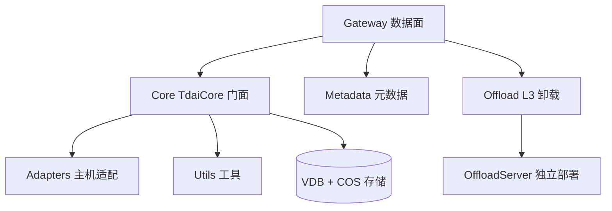

# MemoryCore 模块

> 子系统根：MemoryCore/（含 src/gateway、src/core、src/metadata、src/offload、src/offload_server、src/adapters、src/utils）
> 职责：TencentDB [Agent](../../../MemoryPanel/web/src/lib/api/types.ts) Memory 的记忆核心——团队记忆的存储、检索、卸载与隔离。

## 1. 子系统定位

MemoryCore 是平台的数据面内核，对外通过 Gateway 暴露 REST/WS 接口（L0-L3 数据面 + 4 ID 隔离），对内由 Core 提供主机无关的服务门面（[TdaiCore](../../../MemoryCore/src/core/tdai-core.ts)），并经 Adapters 对接具体 LLM/存储后端。

## 2. 子系统架构

## 3. 子模块索引

- memory_core_gateway.md：REST/WS 数据面、[IdFields](../../../MemoryCore/src/core/skill/types.ts) 隔离、审计、profile 同步
- memory_core_core.md：[TdaiCore](../../../MemoryCore/src/core/tdai-core.ts) 门面、配置源、存储池
- memory_core_metadata.md：记忆元数据与索引
- memory_core_offload.md：L3 长程记忆卸载
- memory_core_offload_server.md：offload 独立部署形态
- memory_core_adapters.md：主机特定适配器
- memory_core_utils.md：通用工具

## 4. 关键设计

- 服务化隔离：(team_id, agent_id, user_id, task_id) 复合唯一键决定数据可见性。
- 分层数据面：L0 Conversation -> L1 Message -> L2 Context -> L3 Offload。
- 主机无关：core 定义接口，adapters 实现，支持多部署形态。
