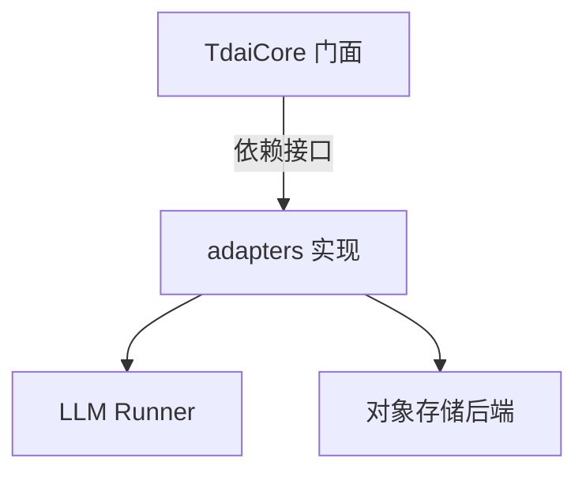

# MemoryCore Adapters 模块

> 子系统：MemoryCore（`MemoryCore/src/adapters`）
> 职责：主机特定的适配器实现（注入 host 相关的 LLM runner / 存储后端）。

## 1. 模块定位

Adapters 把 core 的主机无关接口对接到具体运行环境（不同 LLM 供应商、不同对象存储）。core 仅定义接口，本模块提供实现。

## 2. 架构（Mermaid）

## 3. 依赖

- 被 `[memory_core_core.md](memory_core_core.md)` 引用
