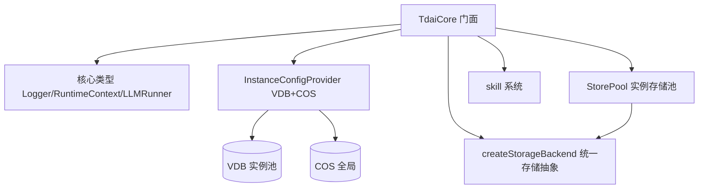

# MemoryCore Core 模块

> 子系统：MemoryCore（`MemoryCore/src/core`）
> 职责：主机无关的核心类型、[TdaiCore](../../../MemoryCore/src/core/tdai-core.ts) 服务门面、配置源（VDB 实例池 + COS 全局）、存储后端抽象、skill 系统。

## 1. 模块定位

Core 是 MemoryCore 的**业务逻辑内核**，完全主机无关。它导出 `TdaiCore` 门面（统一 recall/capture 接口），并依赖可插拔的适配器（host-specific adapters 在 `../adapters/`）。

## 2. 分层架构（Mermaid）

## 3. 核心组件

- `TdaiCore`：面向 [Agent](../../../MemoryPanel/web/src/lib/api/types.ts) 的 recall（回忆）/ capture（捕获）服务门面。
- `InstanceConfigProvider` / `LocalConfigSource`：每个 instanceId 的 VDB 配置 + 全局 COS 配置。`IConfigSource` 可自定义。
- `StorePool` / `PooledStore`：按 instanceId 池化 Store 实例，`StoreMode` 控制读写模式。
- `createStorageBackend`：统一文件/对象存储抽象；远程对象存储后端动态加载。
- `LocalStorageBackend` / `StoragePaths` / `StorageAdapter`：本地存储实现。
- CredentialProvider 体系：`MockCredentialProvider` / `StaticCredentialProvider` / `CachedCredentialProvider` / `PrefixedCredentialProvider` / `parseCosUrl`。

## 4. 依赖关系

- 上游：`[memory_core_adapters.md](memory_core_adapters.md)`（注入 host 适配器）
- 下游：`[memory_core_gateway.md](memory_core_gateway.md)`（gateway 调用 core 服务）
- 横向：被 MemoryProxy 通过 memory-bridge 复用

## 5. 关键设计

- **主机无关**：core 只定义接口，适配器在 `adapters/` 实现，支持多部署形态。
- **配置分离**：VDB 按实例池化，COS 全局共享。
- **存储抽象**：文件/对象统一入口，远程后端按需动态加载。

## 6. 文件清单

| 路径 | 职责 |
|------|------|
| `core/index.ts` | barrel 导出 |
| `core/tdai-core.ts` | [TdaiCore](../../../MemoryCore/src/core/tdai-core.ts) 门面 |
| `core/types.ts` | 核心类型 |
| `core/instance-config-provider.ts` | 配置源 |
| `core/store/store-pool.ts` | 存储池 |
