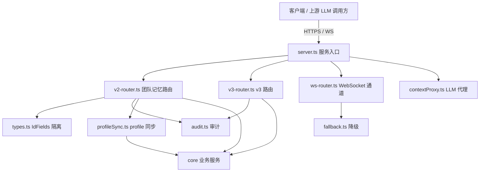
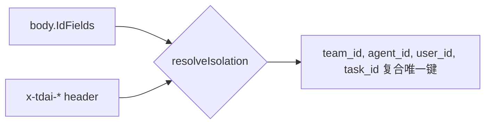

# MemoryCore Gateway 模块

> 子系统：MemoryCore（`MemoryCore/src/gateway`）
> 职责：对外暴露 REST API（v2/v3）与 WebSocket，承载团队记忆的数据面接口、身份隔离、审计与 profile 同步。

## 1. 模块定位

Gateway 是 MemoryCore 对外的**唯一数据面入口**。它把「团队记忆 REST 契约（offload.yaml 的 13 个接口 + 可选的 4 ID 隔离字段）」落地为可运行的服务，并叠加审计、profile 同步、会话管理、限流等基础设施能力。

- 入口：`server.ts`（HTTP 服务启动、中间件装配）
- 路由：`v2-router.ts`（v2 团队记忆路由）、`v3-router.ts`（v3 路由）、`ws-router.ts`（WebSocket 实时通道）
- 类型：`types.ts`（v2 请求/响应契约、[IdFields](../../../MemoryCore/src/core/skill/types.ts) 四 ID 隔离字段）
- LLM 代理：`contextProxy.ts`、`fallback.ts`（对上游 LLM 的代理与降级）
- 审计：`audit.ts`
- profile 同步：`profileSync.ts`

## 2. 分层架构（Mermaid）

## 3. 核心接口（L0–L3 数据面）

基于 `docs/team-api-仅memory.yaml`，数据面分四层：

- **L0 Conversation**：`ConversationAddRequest` / `ConversationQueryRequest` —— 会话级记忆的写入与查询。
- **L1 Message**：单条消息粒度。
- **L2 Context**：上下文注入（被 MemoryProxy 的 memory-bridge 复用）。
- **L3 Offload**：长程记忆卸载（offload.yaml 的 13 个接口）。

见 [memory_core_offload.md](memory_core_offload.md) 了解 L3 卸载语义。

## 4. 身份隔离模型（IdFields）

`IdFields`（team_id / agent_id / user_id / task_id）四字段**全部可选**，接口 schema 层不做必填校验。服务端 `resolveIsolation` 优先取 body 字段，缺失时回退 `x-tdai-*` header。

旧客户端不传 [IdFields](../../../MemoryCore/src/core/skill/types.ts) 时按原 offload 语义工作，保证向后兼容。

## 5. 审计（audit.ts）

所有写操作（ConversationAdd、Offload 等）经审计层落盘，记录操作主体（由 [IdFields](../../../MemoryCore/src/core/skill/types.ts) 决议）、对象、时间戳，支持团队级合规追溯。

## 6. profile 同步（profileSync.ts）

跨 agent / 跨会话的 profile（长期用户画像）通过 `profileSync` 与服务层同步，保证同一 `user_id` 在多个 `agent_id` 间的画像一致。

## 7. LLM 代理与降级（contextProxy / fallback）

`contextProxy.ts` 将记忆检索结果注入 LLM 上下文；`fallback.ts` 在上游 LLM 不可用时降级，保证记忆读写链路不中断。

## 8. 依赖关系

- 下游：`[memory_core_core.md](memory_core_core.md)`、[memory_core_metadata.md](memory_core_metadata.md)
- 跨服务：被 `MemoryProxy`（见 [memory_proxy_handlers.md](memory_proxy_handlers.md)）通过 memory-bridge 复用 L2 上下文能力

## 9. 关键文件清单

| 文件 | 职责 |
|------|------|
| `server.ts` | HTTP/WS 服务启动、中间件装配 |
| `v2-router.ts` | v2 团队记忆 REST 路由 |
| `v3-router.ts` | v3 路由 |
| `ws-router.ts` | WebSocket 实时通道 |
| `types.ts` | v2 契约、[IdFields](../../../MemoryCore/src/core/skill/types.ts) 隔离字段 |
| `contextProxy.ts` | LLM 上下文代理 |
| `fallback.ts` | 上游降级 |
| `audit.ts` | 审计 |
| `profileSync.ts` | profile 同步 |

## 10. 设计要点与约束

- **向后兼容**：[IdFields](../../../MemoryCore/src/core/skill/types.ts) 全可选，旧 offload 客户端无需改造。
- **隔离边界**：复合唯一键 `(team_id, agent_id, user_id, task_id)` 决定数据可见性。
- **可观测**：审计 + profile 同步保证团队级可追溯与一致性。
