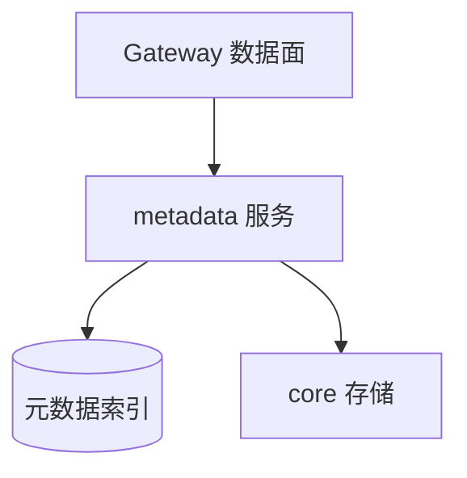

# MemoryCore Metadata 模块

> 子系统：MemoryCore（`MemoryCore/src/metadata`）
> 职责：记忆元数据存储与索引（向量/标量混合检索所需的元数据层）。

## 1. 模块定位

Metadata 模块管理每条记忆的元数据（标签、时间戳、来源、隔离字段），支撑 L0–L3 各层的数据面做高效过滤与检索。

## 2. 架构（Mermaid）

## 3. 关键职责

- 接收来自 gateway 的 [IdFields](../../../MemoryCore/src/core/skill/types.ts) 隔离字段，写入元数据并参与检索过滤。
- 为向量检索提供标量过滤条件。
- 维护记忆生命周期（创建/访问/过期）。

## 4. 依赖

- 上游：`[memory_core_gateway.md](memory_core_gateway.md)`
- 下游：`[memory_core_core.md](memory_core_core.md)`
