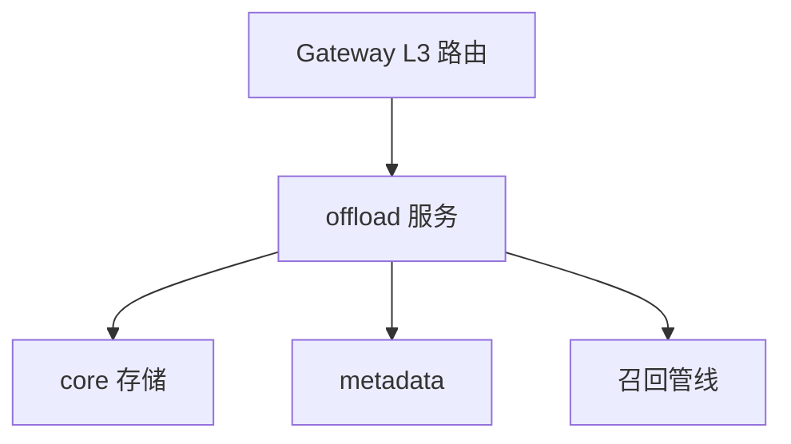

# MemoryCore Offload 模块

> 子系统：MemoryCore（`MemoryCore/src/offload`）
> 职责：L3 长程记忆卸载（offload.yaml 13 接口）的服务实现。

## 1. 模块定位

Offload 实现「长程记忆卸载」语义：把超出上下文窗口的历史记忆外置存储，并在需要时召回。是团队记忆契约中最高层（L3）的数据面。

## 2. 架构（Mermaid）

## 3. 接口（offload.yaml 13 接口）

团队记忆契约在 offload.yaml 的 13 个接口基础上，叠加可选 [IdFields](../../../MemoryCore/src/core/skill/types.ts) 实现服务化隔离。

## 4. 依赖

- 上游：`[memory_core_gateway.md](memory_core_gateway.md)`
- 下游：`[memory_core_core.md](memory_core_core.md)`、`[memory_core_metadata.md](memory_core_metadata.md)`
