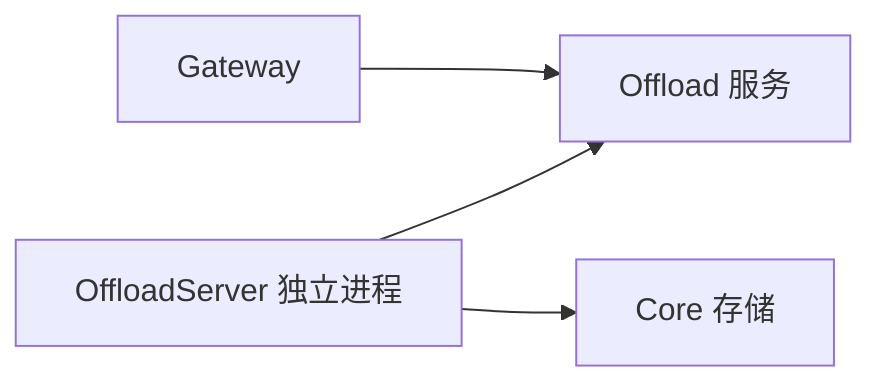

# MemoryCore Offload Server 模块

> 子系统：MemoryCore（`MemoryCore/src/offload_server`）
> 职责：offload 服务的独立部署形态（server 化封装）。

## 2. 部署形态

## 2. 依赖

- 复用于 `[memory_core_offload.md](memory_core_offload.md)` 的服务逻辑
- 复用 `[memory_core_core.md](memory_core_core.md)` 的存储/配置
