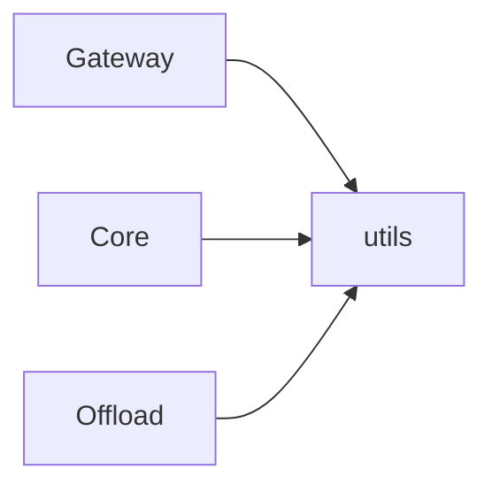

# MemoryCore Utils 模块

> 子系统：MemoryCore（`MemoryCore/src/utils`）
> 职责：通用工具函数（日志、序列化、ID 生成等）。

## 1. 模块定位

跨模块复用的基础设施工具。

## 2. 依赖关系

```mermaid
graph LR
  Gateway[Gateway] --> Utils[utils]
  Core[Core] --> Utils
  Offload[Offload] --> Utils
```

## 2. 依赖

- 被 MemoryCore 各模块引用
