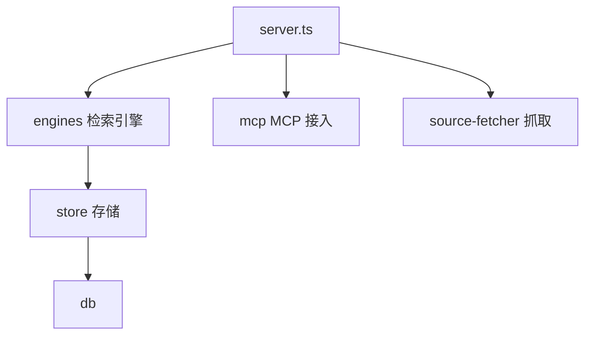

# MemoryKnowledge 模块

> 子系统根：MemoryKnowledge/（含 src/server、src/engines、src/mcp、src/source-fetcher、src/store、src/routes、src/middleware、src/db）
> 职责：团队知识库本体——领域建模、知识检索、MCP 接入、多源抓取。

## 1. 子系统定位

MemoryKnowledge 与 MemoryCore 互补：Core 管记忆（会话级、临时），Knowledge 管知识（领域级、持久）。提供引擎化检索与 MCP 协议接入。

## 2. 架构

## 3. 子模块索引

- memory_knowledge_src.md：服务入口、引擎、MCP、抓取、存储全貌

## 4. 关键设计

- 领域建模：engines 提供检索/建模能力。
- MCP 原生：mcp/ 层以 Model Context Protocol 接入。
- 多源抓取：source-fetcher 从文档/代码/Web 采集知识。
