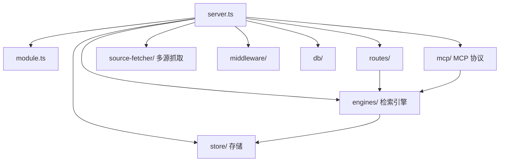

# MemoryKnowledge Src 模块

> 子系统：MemoryKnowledge（`MemoryKnowledge/src`）
> 职责：团队知识库本体——领域建模引擎、MCP 接入、检索、存储。

## 1. 模块定位

MemoryKnowledge 是「知识」子系统，与 MemoryCore 的「记忆」互补：提供领域建模（domain modeling）、知识检索（engines）、MCP 协议接入（mcp）、多源抓取（source-fetcher）。

## 2. 目录架构（Mermaid）

## 3. 核心组件

- `server.ts` / `module.ts`：服务入口与模块装配。
- `engines/`（21 文件）：知识检索/领域建模引擎。
- `mcp/`：Model Context Protocol 接入层。
- `source-fetcher/`：多源知识抓取（文档、代码、Web 等）。
- `store/`（10 文件）：知识存储抽象。
- `routes/` / `middleware/` / `db/`：路由、中间件、数据库层。
- `config.ts` / `logger.ts` / `telemetry.ts` / `callback.ts` / `api-helpers.ts`：基础设施。

## 4. 依赖关系

- 横向：与 `[memory_core_core.md](memory_core_core.md)` 协同（记忆 + 知识）
- 被 MemoryPanel 可视化、MemoryProxy 代理调用

## 5. 关键文件

| 文件 | 职责 |
|------|------|
| `server.ts` | 服务入口 |
| `engines/*.ts` | 检索/建模引擎 |
| `mcp/*.ts` | MCP 接入 |
| `source-fetcher/*.ts` | 多源抓取 |
| `store/*.ts` | 存储 |
