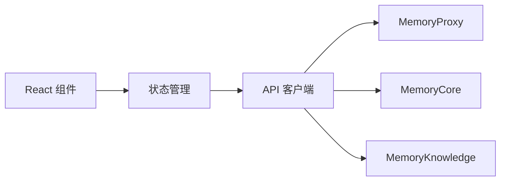

# MemoryPanel Web 模块

> 子系统：MemoryPanel（`MemoryPanel/web/src`）
> 职责：记忆/知识的可视化管理面板前端（React + TypeScript）。

## 1. 模块定位

MemoryPanel 是面向用户的**可视化控制台**，展示记忆、知识、会话与团队隔离视图，并提供管理操作。

## 2. 技术栈（Mermaid）

## 3. 职责

- 记忆检索与回溯可视化
- 知识库（MemoryKnowledge）浏览
- 团队/agent 隔离字段管理
- 审计与 profile 查看

## 4. 依赖

- 后端：`[memory_proxy_handlers.md](memory_proxy_handlers.md)`、`[memory_core_gateway.md](memory_core_gateway.md)`、`[memory_knowledge_src.md](memory_knowledge_src.md)`
