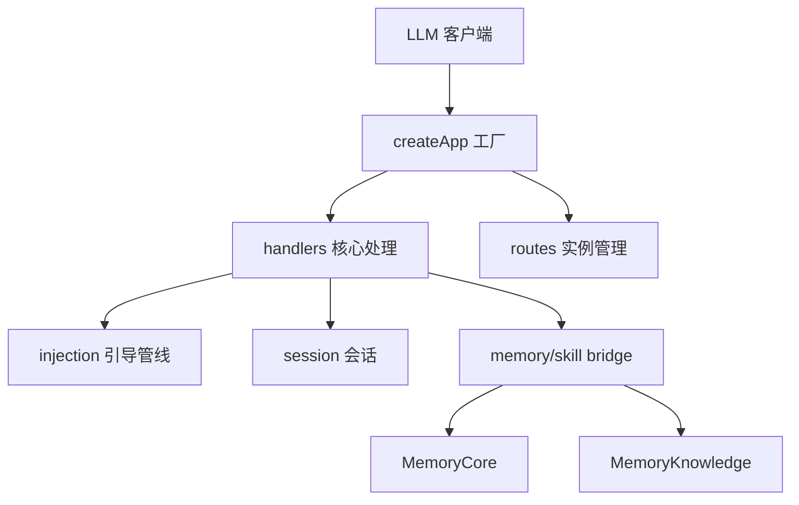

# MemoryProxy 模块

> 子系统根：MemoryProxy/（含 src、src/routes、src/injection、src/session）
> 职责：LLM 代理网关——把记忆/技能能力透明注入上游 LLM（OpenAI/Anthropic 兼容）请求。

## 1. 子系统定位

MemoryProxy 是平台的接入层：以 Hono 应用拦截 LLM 流量，在请求/响应中注入 MemoryCore 的记忆上下文与技能调用，对客户端透明。

## 2. 架构

## 3. 子模块索引

- memory_proxy_handlers.md：Hono 工厂、chat/completions、messages、bridge
- memory_proxy_routes.md：实例销毁、限流、白名单
- memory_proxy_injection.md：storage/redis 激活管线
- memory_proxy_session.md：会话状态管理

## 4. 关键设计

- 透明代理：客户端无需改动即可获得记忆注入。
- cost-guard marker：markerOptIn 门控（P0 前置）。
- 多节点一致性：storage 降级时 /health 返回 503 让 LB 摘 pod。
- 版本：0.2.0
