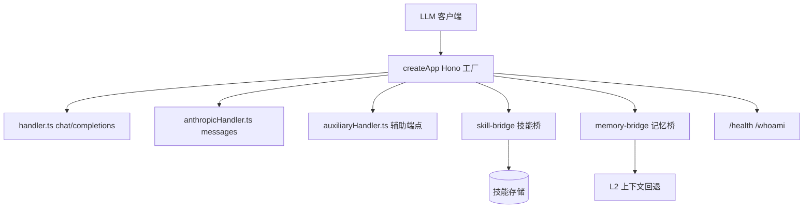

# MemoryProxy Handlers 模块

> 子系统：MemoryProxy（`MemoryProxy/src`）
> 职责：Hono 应用工厂与核心请求处理（OpenAI / Anthropic 兼容、auxiliary、skill-bridge、memory-bridge）。

## 1. 模块定位

Handlers 是 MemoryProxy 的**入口与核心**：以 Hono 应用工厂注册全部路由，把上游 LLM 的 `/v1/chat/completions`、`/v1/messages` 等请求拦截并注入记忆能力。

## 2. 架构（Mermaid）

## 3. 关键文件（server.ts 已读）

- `server.ts`：`createApp(config)` —— 注册全部路由、cost-guard marker 门控、health/whoami。
- `handler.ts`：`handleChatCompletions`（OpenAI 兼容）。
- `anthropicHandler.ts`：`handleAnthropicMessages`。
- `auxiliaryHandler.ts`：辅助端点。
- `skill/skill-bridge.ts`：技能桥接。
- `memory/memory-bridge.ts`：记忆桥接（L2 上下文回退）。
- `opik.ts`：apiKey → keyId、Bearer 解析。
- `storage/factory.ts`：存储后端工厂 `getEffectiveBackend`。
- `routes/instance-destroy.ts`、`routes/rate-limits.ts`、`routes/whitelist.ts`：实例销毁 / 限流 / 白名单。

## 4. 关键设计

- **cost-guard marker**：`config.costGuard.markerOptIn=false` 时带 `/cost-guard/` 的请求直接 404（P0 前置）。
- **多节点一致性**：storage 降级到进程内时 `/health` 返回 503 + `degraded=true`，让 k8s LB 摘掉 pod。
- **eager storage 激活**：bridge-only 请求也能经 L2 回退恢复会话状态。

## 5. 依赖

- 下游：`[memory_proxy_injection.md](memory_proxy_injection.md)`、`[memory_proxy_session.md](memory_proxy_session.md)`、`[memory_proxy_routes.md](memory_proxy_routes.md)`
- 复用 `[memory_core_core.md](memory_core_core.md)` 的记忆能力（经 memory-bridge）
- 版本：`version: 0.2.0`
