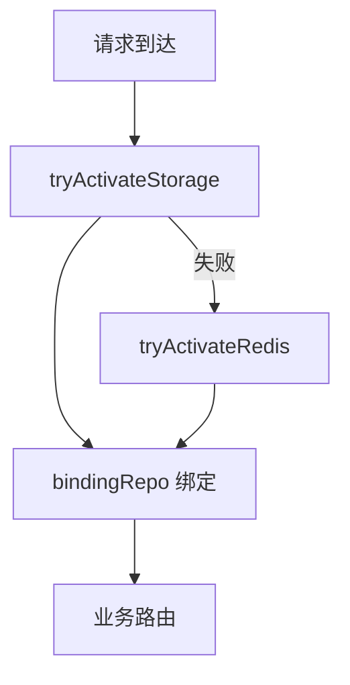

# MemoryProxy Injection 模块

> 子系统：MemoryProxy（`MemoryProxy/src/injection`）
> 职责：依赖注入管线（storage / redis 激活、会话状态恢复）。

## 1. 模块定位

Injection 是 MemoryProxy 的**引导管线**：在请求到达前激活存储后端（COS/SQLite）、Redis，并恢复会话绑定仓库（bindingRepo）。

## 2. 架构（Mermaid）

## 3. 关键导出（server.ts 已引用）

- `tryActivateStorage(config)`：激活存储（COS 优先，降级 SQLite/fs）。
- `tryActivateRedis(config)`：激活 Redis。

## 4. 依赖

- 被 `[memory_proxy_handlers.md](memory_proxy_handlers.md)` 调用
