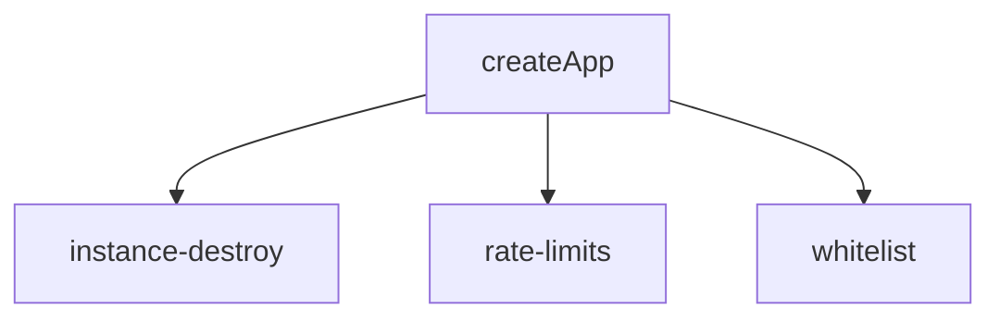

# MemoryProxy Routes 模块

> 子系统：MemoryProxy（`MemoryProxy/src/routes`）
> 职责：实例级路由（instance-destroy、rate-limits、whitelist）。

## 1. 模块定位

Routes 提供实例管理类端点：销毁实例、限流策略、白名单判定。

## 2. 路由关系

## 2. 关键文件

- `instance-destroy.ts`：实例销毁处理器。
- `rate-limits.ts`：TPM/QPM 限流。
- `whitelist.ts`：`hasCostGuardMarker` 等白名单判定。

## 3. 依赖

- 被 `[memory_proxy_handlers.md](memory_proxy_handlers.md)` 引用
- 复用 `[memory_core_core.md](memory_core_core.md)` 实例存储
