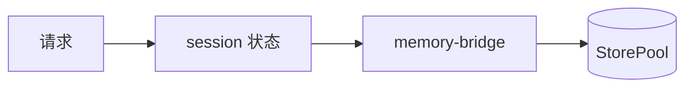

# MemoryProxy Session 模块

> 子系统：MemoryProxy（`MemoryProxy/src/session`）
> 职责：会话状态管理（多轮对话、跨请求会话恢复）。

## 1. 模块定位

Session 维护 LLM 调用的会话上下文，支撑 memory-bridge 的 L2 回退与 skill-bridge 的会话级技能调用。

## 2. 会话流

## 2. 依赖

- 被 `[memory_proxy_handlers.md](memory_proxy_handlers.md)` 引用
- 与 `[memory_core_core.md](memory_core_core.md)` 的 [StorePool](../../../MemoryCore/src/core/store/store-pool.ts) 协同
