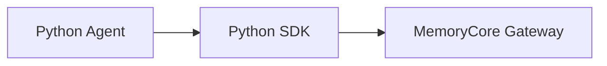

# SDK Python 模块

> 子系统：sdk（`sdk/memory-core/python`）
> 职责：Python 客户端 SDK，供 Python [Agent](../../../MemoryPanel/web/src/lib/api/types.ts) 调用 MemoryCore。

## 1. 模块定位

Python SDK 与 TypeScript SDK 对等，面向 Python 生态的 [Agent](../../../MemoryPanel/web/src/lib/api/types.ts) 应用。

## 2. 调用关系

## 2. 依赖

- 对齐 `[memory_core_gateway.md](memory_core_gateway.md)` 契约
- 与 `[sdk_typescript.md](sdk_typescript.md)` 类型语义一致
