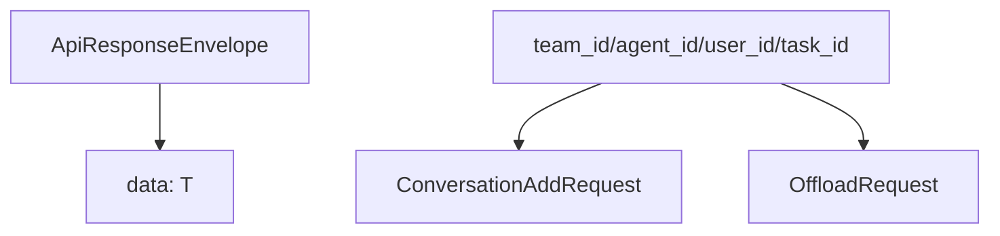

# SDK TypeScript 模块

> 子系统：sdk（`sdk/memory-core/typescript`）
> 职责：TypeScript 客户端 SDK，暴露类型与记忆核心 API。

## 1. 模块定位

TypeScript SDK 让前端/Node 应用以类型安全的方式调用 MemoryCore。已读取 `src/types.ts`：定义 v2 请求/响应类型与 [IdFields](../../../MemoryCore/src/core/skill/types.ts) 隔离字段。

## 2. 类型（Mermaid）

## 3. 关键类型

- `ApiResponseEnvelope<T>`：统一响应包（code/message/request_id/data）。
- `IdFields`：四 ID 隔离字段（可选）。
- `ConversationItem` / `ConversationAddRequest`：会话记忆类型。

## 4. 依赖

- 对齐 `[memory_core_gateway.md](memory_core_gateway.md)` 的 v2 契约
