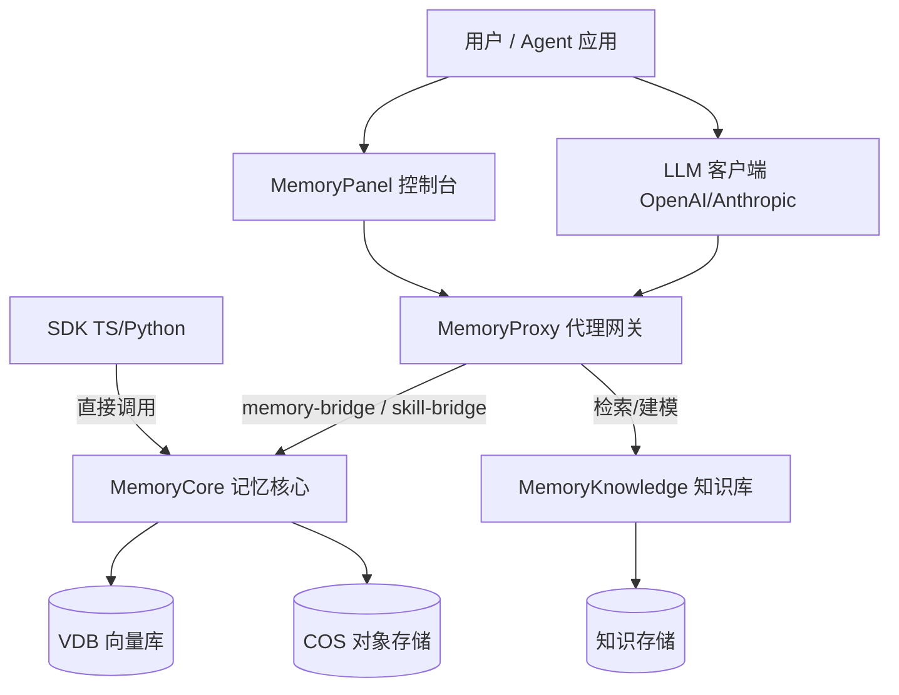
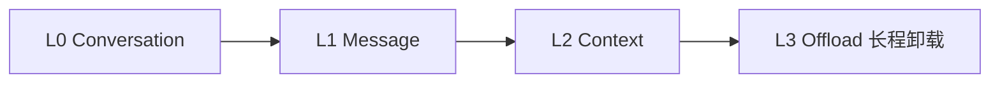

# Team-Agent-Memory 仓库总览

> TencentDB [Agent](../../MemoryPanel/web/src/lib/api/types.ts) Memory（腾讯开源的 [Agent](../../MemoryPanel/web/src/lib/api/types.ts) 记忆平台）：为 AI [Agent](../../MemoryPanel/web/src/lib/api/types.ts) 提供长期记忆与团队知识沉淀能力。

## 1. 项目定位

本仓库实现一套面向多 [Agent](../../MemoryPanel/web/src/lib/api/types.ts) 协作的**记忆与知识平台**，核心能力：

- **团队记忆**：以 `(team_id, agent_id, user_id, task_id)` 复合唯一键实现服务化隔离的长期记忆。
- **团队知识**：持久化的领域建模与知识检索（MemoryKnowledge）。
- **透明代理**：在 LLM 流量中注入记忆/技能，对客户端无感（MemoryProxy）。
- **可视化管理**：记忆、知识、会话、隔离视图的统一控制台（MemoryPanel）。
- **多语言 SDK**：TypeScript / Python 客户端。

## 2. 端到端架构

## 3. 分层数据面（MemoryCore）

Gateway 暴露 L0-L3 四级数据面：

## 4. 子系统模块索引

| 子系统 | 文档 | 职责 |
|--------|------|------|
| MemoryCore | [memory_core.md](modules/memory_core.md) | 记忆存储、检索、卸载、隔离 |
| MemoryKnowledge | [memory_knowledge.md](modules/memory_knowledge.md) | 领域建模、知识检索、MCP 接入 |
| MemoryProxy | [memory_proxy.md](modules/memory_proxy.md) | LLM 代理网关、记忆注入 |
| MemoryPanel | [memory_panel.md](modules/memory_panel.md) | 可视化控制台 |
| SDK | [sdk.md](modules/sdk.md) | 多语言客户端 |

### MemoryCore 子模块

- [memory_core_gateway.md](modules/memory_core_gateway.md)：REST/WS 数据面、[IdFields](../../MemoryCore/src/core/skill/types.ts) 隔离、审计、profile 同步
- [memory_core_core.md](modules/memory_core_core.md)：[TdaiCore](../../MemoryCore/src/core/tdai-core.ts) 门面、配置源、存储池
- [memory_core_metadata.md](modules/memory_core_metadata.md)：记忆元数据与索引
- [memory_core_offload.md](modules/memory_core_offload.md)：L3 长程记忆卸载
- [memory_core_offload_server.md](modules/memory_core_offload_server.md)：offload 独立部署形态
- [memory_core_adapters.md](modules/memory_core_adapters.md)：主机特定适配器
- [memory_core_utils.md](modules/memory_core_utils.md)：通用工具

### MemoryKnowledge 子模块

- [memory_knowledge_src.md](modules/memory_knowledge_src.md)：服务入口、引擎、MCP、抓取、存储全貌

### MemoryProxy 子模块

- [memory_proxy_handlers.md](modules/memory_proxy_handlers.md)：Hono 工厂、chat/completions、messages、bridge
- [memory_proxy_routes.md](modules/memory_proxy_routes.md)：实例销毁、限流、白名单
- [memory_proxy_injection.md](modules/memory_proxy_injection.md)：storage/redis 激活管线
- [memory_proxy_session.md](modules/memory_proxy_session.md)：会话状态管理

### MemoryPanel 子模块

- [memory_panel_web.md](modules/memory_panel_web.md)：React 前端全貌

### SDK 子模块

- [sdk_typescript.md](modules/sdk_typescript.md)：TypeScript SDK
- [sdk_python.md](modules/sdk_python.md)：Python SDK

## 5. 关键架构决策

- **服务化隔离模型**：`(team_id, agent_id, user_id, task_id)` 复合唯一键决定数据可见性，旧 offload 客户端向后兼容。
- **主机无关内核**：MemoryCore core 定义接口，adapters 实现具体 LLM/存储后端，支持多部署形态。
- **透明代理**：MemoryProxy 拦截 LLM 流量注入记忆，客户端零改造。
- **多节点一致性**：storage 降级到进程内时 `/health` 返回 503 + degraded，让 k8s LB 摘掉 pod，避免数据不一致。
- **cost-guard marker**：markerOptIn 门控作为 P0 前置，禁用以避免误导客户端。

## 6. 技术栈

- 语言：TypeScript（MemoryCore / MemoryProxy / MemoryPanel / SDK-TS）、Python（MemoryKnowledge / SDK-PY）
- Web 框架：Hono（MemoryProxy）、React（MemoryPanel）
- 存储：VDB 向量库、COS 对象存储、SQLite/fs 降级

## 7. 部署形态与运维

除 `deploy/` 下的多服务部署（start-all.sh 三件套）外，仓库根目录提供单机形态：

- `tdai-gateway.yaml`：TDAI Gateway 单机配置（deployMode=standalone、stateBackend=local、sqlite 存储、默认关闭向量检索仅用 BM25），监听 8420 端口，LLM Key 经 `TDAI_LLM_API_KEY` 环境变量注入。
- `deploy-helper.ps1`：Windows SSH 部署辅助脚本（OpenSSH 交互式密码注入）。
- `modules-llm-analysis.md`：LLM 依赖穷尽式分析报告——结论：仅 MemoryKnowledge 的 Wiki 摄入链路硬依赖 LLM，MemoryProxy/MemoryPanel/SDK 均无 LLM 推理；deploy 脚本的强制校验是"零 LLM 启动"的最大阻断点。

## 8. Agent 协作约定

- `AGENTS.md`：项目级 [Agent](../../MemoryPanel/web/src/lib/api/types.ts) 指引入口（issue tracker、triage labels、domain docs、CodeWiki LLM Wiki 使用与知识沉淀流程）。
- `docs/agents/`：[Agent](../../MemoryPanel/web/src/lib/api/types.ts) 工作流约定——`issue-tracker.md`（GitHub `gh` CLI 操作约定）、`triage-labels.md`（五角色 triage 标签映射）、`domain.md`（领域文档 CONTEXT.md / ADR 消费规则）。
